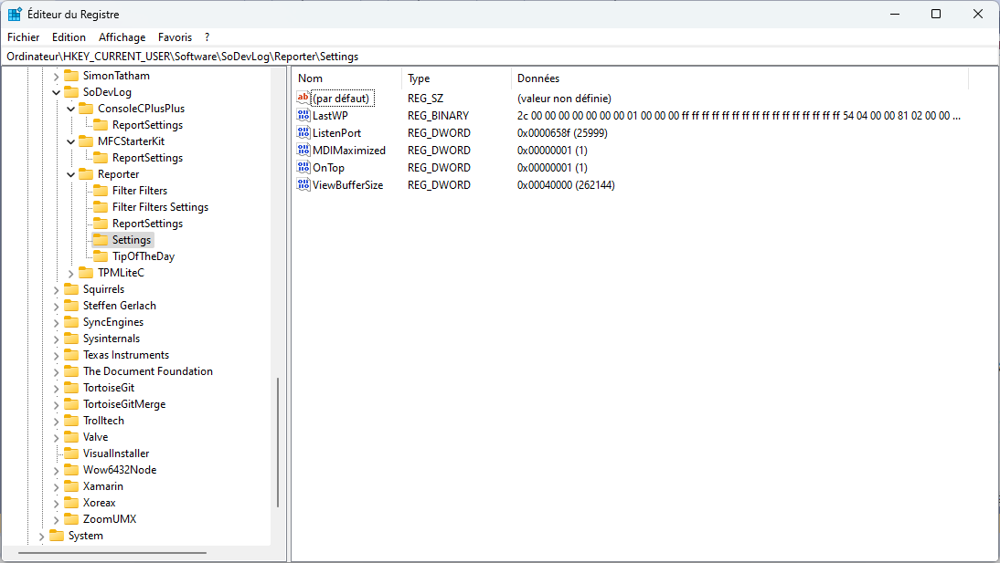

# ASReporter

The Display Traces Application, connected by socket to your application under traces thanks to ASTrace.dll

You'll find user's doc in .\Doc

## Delivery 

Directory development is:

G:\Mabyre\SouthOfFrance\Bruno\Developpement\Visual C++ 6.0\ASReporter\ASReporterSources

To deliver a new Reporter version copy the file:

G:\Mabyre\SouthOfFrance\Bruno\Developpement\Visual C++ 6.0\ASReporter\ASReporterSources\Release\Reporter.exe

Into the Delivery directory:

G:\Mabyre\SouthOfFrance\Bruno\Developpement\Visual C++ 6.0\ASReporter\Release

All shortcuts should reference this file.

## Developers

Reporter application is intresting by the fack of non using MFC but ObjectSet a software product from Smartcode Software, Inc.

Reporter settings are in Registry:

