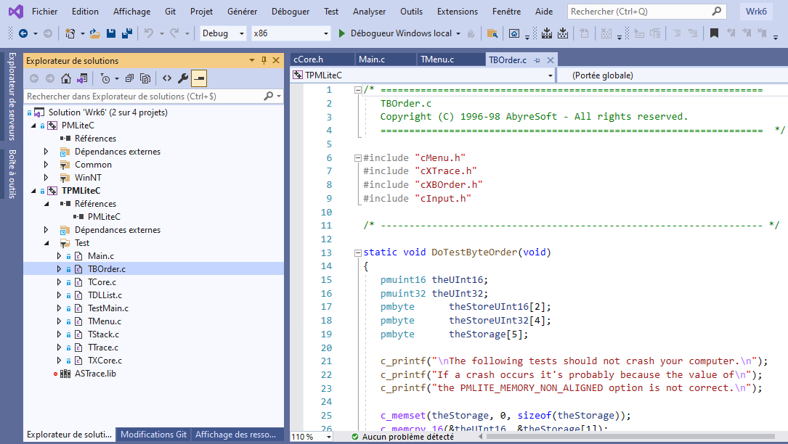
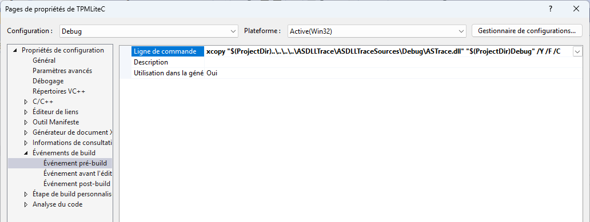

## PMLiteC

Portable Protocol Machinery in C

It's a big mess not so evident to make it evoluate but, the aim was to make multiplateform code
so, sources are "inside" the PMLiteC and you should deliver for one or for another platform.

I wanted to keep this organisation, I have no other needs but, if you make some modifications in PMLite depending on the use you make in your Console Project, you should release carefully.

### Take in Hands

Normaly, all you have to car about here is:
- the ***.\inc*** directory with all ***.h*** to use ***PMLiteC.lib***
- the ***.\lib*** directory where take place the ***PMLiteC.lib***

So the first solution (recommanded) you have to use PMLiteC is:
- Add the lib ***.\PMLiteC\lib\Debug\PMLiteC.lib*** to the project 
- Add a reference to ***.\inc*** directory

Now imagine you'de like to materise the PMLiteC:
- Add the project ***\PMLitec\Wrk6\PMLiteC\PMLiteC.dsp*** to the workspace and check the PMLiteC box into
the dependencies

If you Add the PMLiteC project into your solution then keep in mind that ***PMLiteC.lib*** is deliver in the following directory:

    Console-CPlusPlus-StarterKit\PMLiteC\PMLitec\Wrk6\PMLiteC\Debug

Then, if you added the inc directory :

    Console-CPlusPlus-StarterKit\PMLiteC\inc 

has the included files use in your console, you must synchornise with the "inside" .h (if you make any modification to PMLiteC).

### Delivery summary

When a .h file is modified, it must be placed in ***.\inc*** the emitted library must be
placed in ***.\lib***

The sources of the PMLiteC are in the PMLiteC directory which serves as a console for the tests
specific to PMLiteC.

## PMLiteC comes with it's own full tests

The PMLiteC sources directory of the PMLiteC and a console which is used for the contains tests
specific to PMLiteC.

At this level you are in pure C Langage for portable reasons mentionned above. For protable C code fans here is the treasure.

You cans open the solution:

[TPMLite.sln](https://github.com/mabyre/Console-CPlusPlus-StarterKit/blob/master/PMLiteC/PMLitec/Wrk6/TPMLite.sln)

You will be in front of two projects:

- PMLiteC himself
- TPMLiteC Test for PMLiteC

Here you will learn how to use the PMLiteC and how it's integrated to the [Console C++ Starter Kit](https://github.com/mabyre/Console-CPlusPlus-StarterKit).

### TPMLiteC

In the unlikely event that you need to upgrade or modify the PMLiteC, you are at the right place.

Apart from modifying or evolving the PMLiteC source code here you can see the PMLiteC C source code and start looking at the various portable C language issues on multiple platforms development environment.

The TPMLiteC will show you how to use PMLiteC, have a look to:

- [TPMLiteC\Test\Main.c](https://github.com/mabyre/Console-CPlusPlus-StarterKit/blob/master/PMLiteC/PMLitec/Test/Main.c)

The minimal Console System which allows you to execute commands.

1. Open Traces call ***as_trace_init***
2. Call to ***NT_TestMain***
3. Close Traces and the end of application calling ***as_trace_close***

Have a look to project's the pre-build directive you will understand that you need to run Reporter before running TPMLiteC project:

Memory management for all execution

Menu enhancement

- [TPMLiteC\Test\TestMain.c](https://github.com/mabyre/Console-CPlusPlus-StarterKit/blob/master/PMLiteC/PMLitec/Test/TestMain.c)

Now you see all you can do to make the same in your onwn project.

Last thing I'll show you:

- [TPMLiteC\Test\TBOrder.c](https://github.com/mabyre/Console-CPlusPlus-StarterKit/blob/master/PMLiteC/PMLitec/Test/TBOrder.c)

Test for ***Byte Ordering*** depending on the type platform you are on: LITTLE INDIAN or BIG INDIAN.

You know all, have fun!

