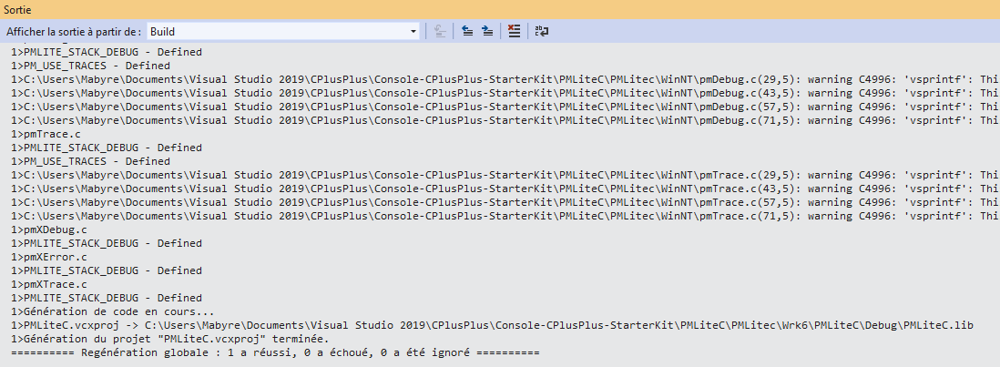
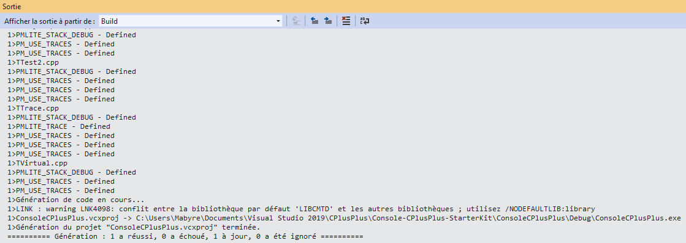
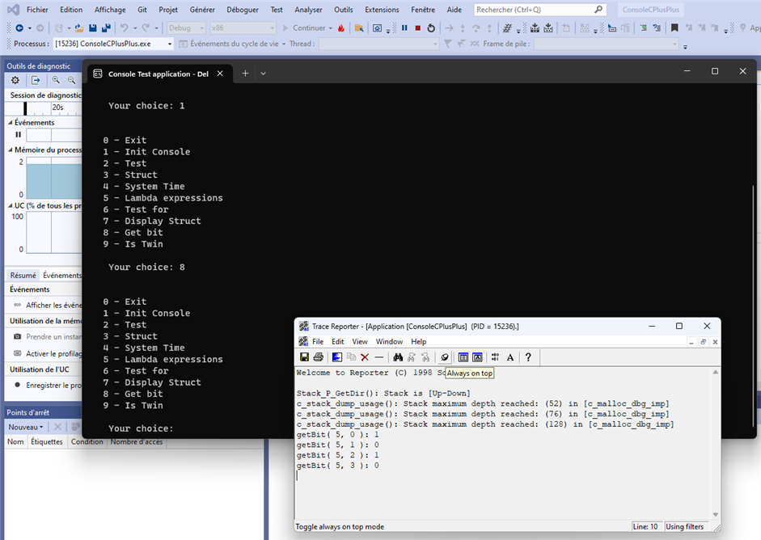

# Console C++ Starter Kit #

For developers vho want to totaly masterise thier developments in C/C++. 

It's a very huge project, in tree parts, hard to take in hands but if you do so, you will be very able to mastrerise all your source codes.

> #### Terms
>
> - **PM** mean Protocol or Protable Machinery for multiplatform development.
>
> - **AS** is for AbyreSoft the beginnings of SoDevLog.

## Features ##

- Masterise your code for multi-plateform development in C/C++
- Driven by console in a smart menu system
- Powerfull functions for memory management
 
## Requirements ##

Fully portable core software in C language so you can pickup some C sources to another plateform.

Any IDE that can make a reference to a library. Here it's ***Visual Studio Community*** but there are many exemples of porting the solution under Eclipse for Linux.

## Summary ##

- [Generate](#Generate) generation is required
- [ASDLLTrace](#ASDLLTrace) the Communication DLL between your code and the Reporter
- [ASReporter](#ASReporter) or Reporter is a windows application that display traces
- [PMLiteC](#PMLiteC) code adapted to your platform for Traces communication
- [ConsoleCPlusPlus](#ConsoleCPlusPlus) your project under test using your code in C/C++

## Want to know more ##

I have wanted to bring to light this project for a long time. I wanted to do this so I could develop with Visual Studio Community to enhence my C++. That's it.

Here is a dedicated blog to ***Trace Reporter***:

- [Blog TraceReporter](https://trace-reporter.sodevlog.com/ "Based on TraceReporter")

Another GitHub project with a Console MinGW that can help:

- [ConsoleMinGW TraceReporter](https://github.com/mabyre/TraceReporter "ConsoleMinGW with TraceReporter")

## For little story ##

One day I made it, I rebuilding this project with ***Visual Studio Community 2019***

I unearthed it from a very old computer for an ***IoT*** project that I had to develop.

For my notes:

\Mabyre\Visual Studio\CPlusPlus\ConsoleCPlusPlusStarterKit\PMLiteC\PMLitec\Wrk6\PMLiteC

Exhumation of a very old project **Protocol Machinery Lite** from :

\Oracle Virtual Box\Windows 7 Ineo 000\Partage\Visual C++ 6.0\Console

From a very old computer named:
\\Mabyre\SouthOfFrance\Visual C++ 6.0

Now it's ready for thousands of years.

## Generate ##

- Clone the repository

> If you directly open the [ConsoleCPlusPlus.sln](https://github.com/mabyre/Console-CPlusPlus-StarterKit/blob/master/ConsoleCPlusPlus/ConsoleCPlusPlus.sln) and run, it will not work.

- Generate [ASDLLTrace](#ASDLLTrace) 

First of all generate ASDLLTrace, open the first solution [ASTrace.sln](https://github.com/mabyre/Console-CPlusPlus-StarterKit/blob/master/ASDLLTrace/ASDLLTraceSources/ASTrace.sln)

Verify you are well in configuration ***Debug x86*** right-click on the project ASTrace:

 Choose Generate:

Open the second solution [ConsoleCPlusPlus.sln](https://github.com/mabyre/Console-CPlusPlus-StarterKit/blob/master/ConsoleCPlusPlus/ConsoleCPlusPlus.sln)

Inside you have two projects, it's your code under test with ConsoleCPlusPlus and PMLiteC

First of all verify you are in configuration x86:

- Generate [PMLiteC](#PMLiteC)

- Generate [ConsoleCPlusPlus](#ConsoleCPlusPlus)

You are now ready to develop your source code in ConsoleCplusPlus and make Traces to the Reporter.

- Run your project

First of All run the Reporter:

Click On Reporter.exe you will find in directory \ASReporter\Release\

The reporter is now listening to traces coming from your application.

> Have a look to the "Tip of the day" : The Reporer can also receive on your desktop traces emited by your application running at one of your client Office during Beta-Testing stage. This imrpoves greatly bugs tracking.

At each time you will need to execute the Reporter before your project therefor the Reporter will listen on sockets to Traces that may come in.

### ASDLLTrace ###

The communication DLL for Traces using socket TCP/IP, used by the Reporter and your project to emite Traces.

Source Code: [ASDLLTrace](https://github.com/mabyre/Console-CPlusPlus-StarterKit/tree/master/ASDLLTrace)

### ASReporter ###

The application that display Traces in a non-MFC windows application

Source Code! [ASReporter](https://github.com/mabyre/Console-CPlusPlus-StarterKit/tree/master/ASReporter)

### PMLiteC ###

The Protocole Machinery adapted to your project

Source Code: [PMLiteC](https://github.com/mabyre/Console-CPlusPlus-StarterKit/tree/master/PMLiteC)

### ConsoleCPlusPlus ###

Your project, your code under tests under Traces

Once you will run your project you can get the following result :

